---

#   Deep Learning

This repository is created for  COMP4329 COMP5329 Deep Learning  Semester 1 2023, Assignment 1

## Abstract of the project

Neural networks, as the foundation of the deep learning methodology, has been gained wide attention over
the years, leading to the desired demand to understand the philosophy and idea behind the Neural Network.
This report will mainly analyze and evaluate each of the self-implemented multilayer perceptron modules
such as the regularization techniques, optimizers, activation functions, etc according to a comprehensive
computational study. Experiments related to each module will be conducted for remedying a 10-class clas-
sification task on 10000 test data samples training in 50000 training data for examining the effectiveness
when changing different hyperparameters while maintaining other modules constantly. Discussion related to
experiment results, limitations of our work, and meaningful conclusions and reflection will also be provided

## Purpose of the study

In this project, we have developed several modules in the neural network from scratch using numpy library, instead of the
API function from PyTorch. The purpose of this study is to understand the fundamental structure and reasoning behind the
neural network and perform a computational study to compare and test the performance when changing various experimental
hyperparameters, such as learning rate, optimizer, etc. We havve developed multiple modules, including activation functions
such as the ReLU function, and optimizers such as Stochastic gradient descent with momentum, regularization technique
including batch normalization, dropout, and mini-batch training procedure. Using test accuracy, execution time, and validation
loss as evaluation metrics, we would like to compare the effect of multilayer perceptron when deploying different combinations
of modules to provide further guidance when training similar models in the future
 

# Group members and Organisation about the course:

---

## Team info:

| Name        | Unikey   |
| ----------- | -------- |
| Junzhi Ning | jnin9950 |
| Yuhao Li    | yuli6273 |

---

# Experiment results

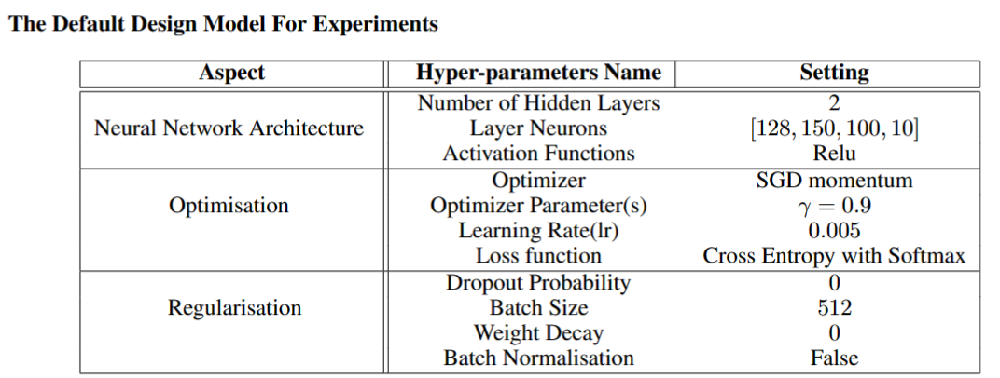

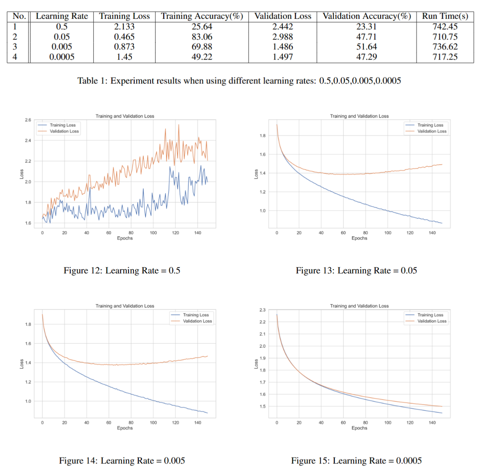

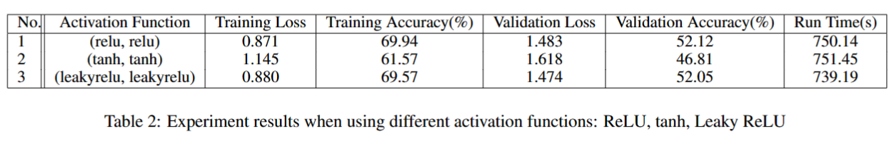

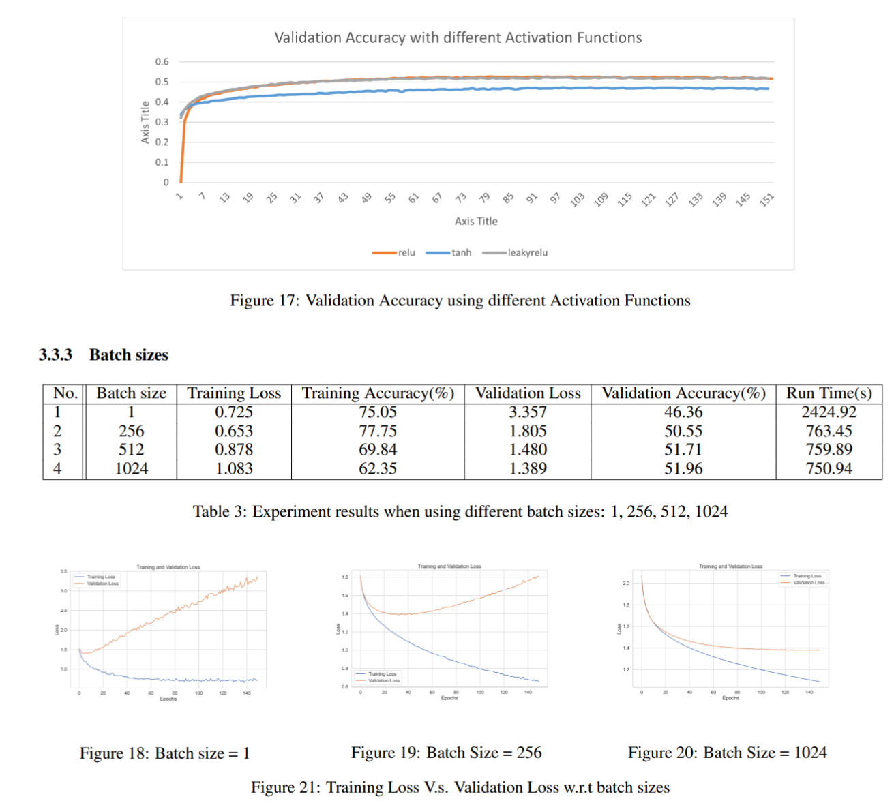

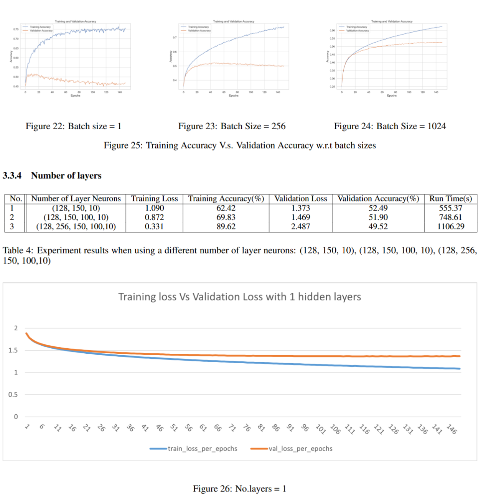

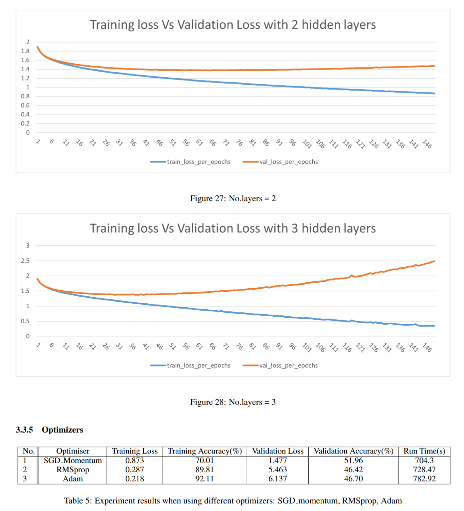

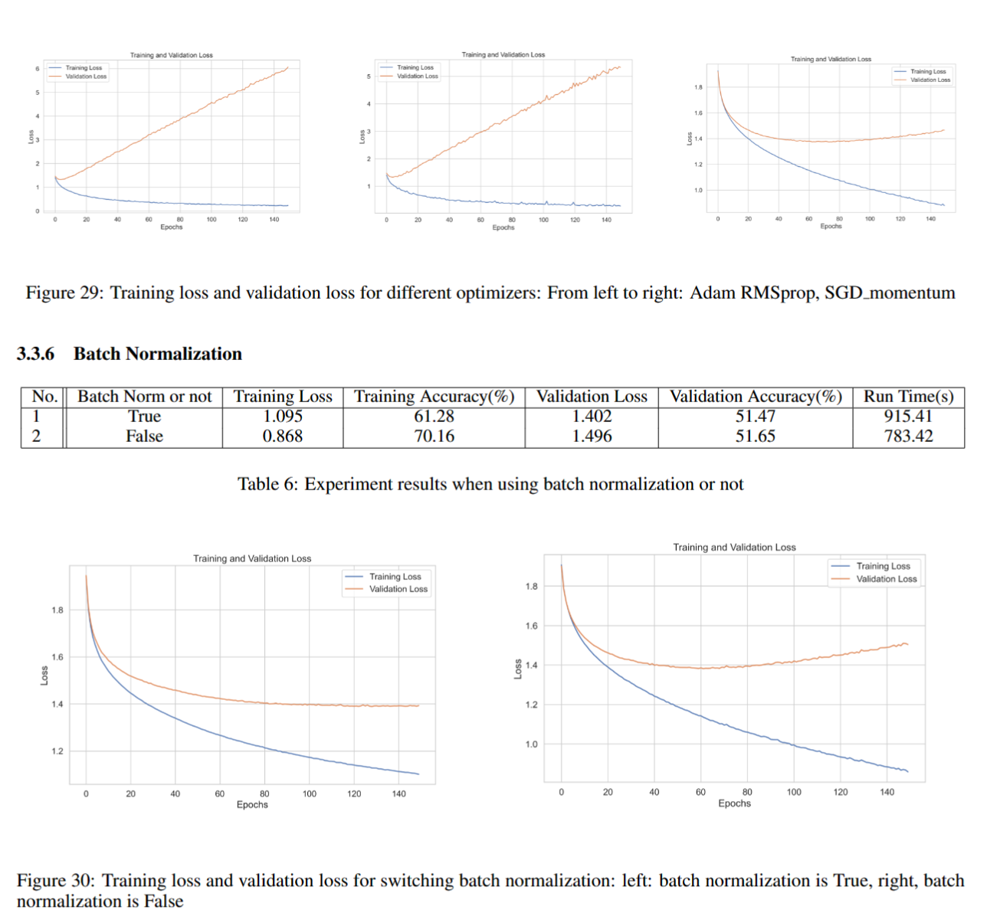

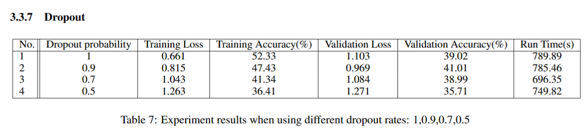

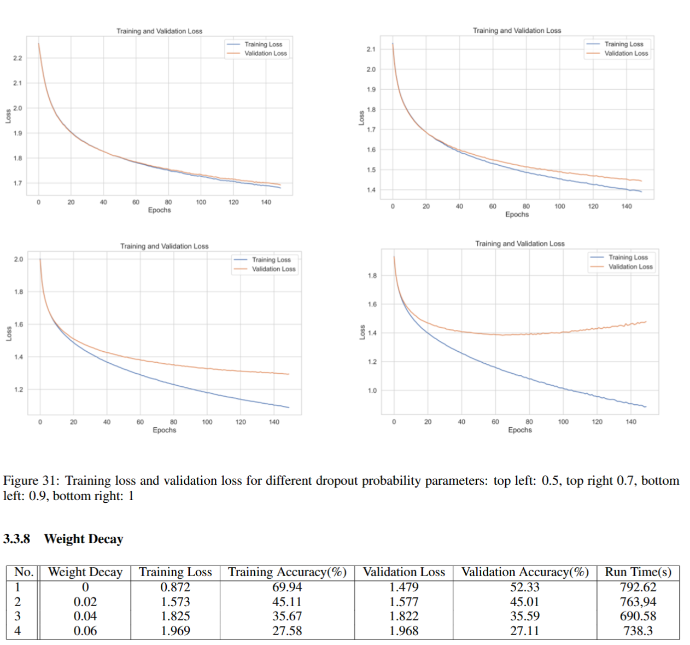

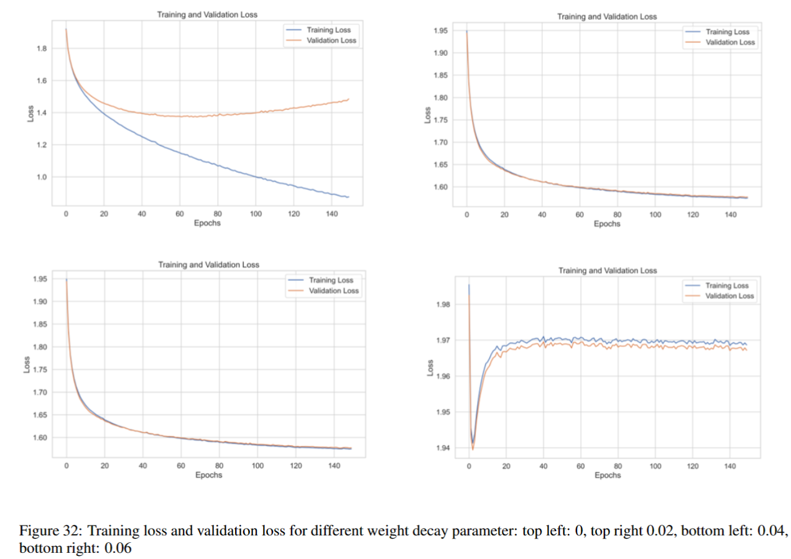

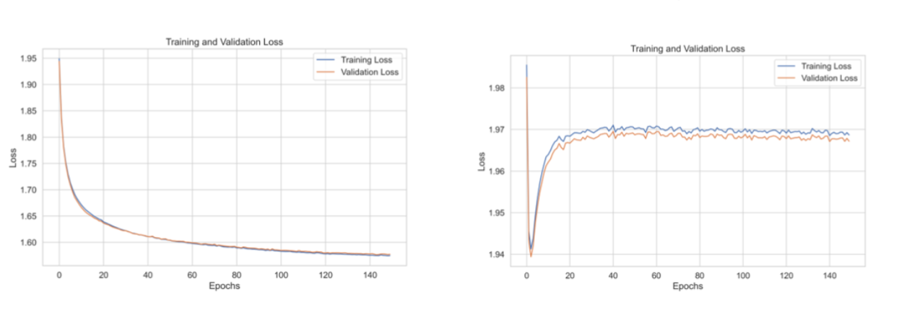

---

# Relevant Resources:

- **Overleaf Report viewing Link:** [https://www.overleaf.com/6912928632bvcjvsqvqwsw](https://www.overleaf.com/read/tyjdbbdspgnf)
- **For complete list of references, please refer to the report** 

---
 Links to code and data:
- Colab Link:  https://colab.research.google.com/drive/1dXEmwSERmW6AQuEix5nve96sZF7zLfU1?usp=sharing   
- The folder of data:  https://drive.google.com/drive/folders/1bKyRx_bGUVoLlaQJTmbTiYOwJpqzjpfV?usp=sharing  
 ---

# Instructions to run the code (How to Run the Code):

To replicate the experiments' results:

- The implementation of MLP used for Deep learning assignment 1 at the University of Sydney adopted the base code provided in the DL tutorial. We extend the implementation to meet the criteria specified by the assessment.

- We present a runnable Jupyter notebook in the above link for submission and demonstration purposes. We used the python files to run the experiment on the local machine, the results are provided in the report.

- To run the notebook, make sure that you run the code block sequentially, this is a crucial step you have to follow!
- To run the codes, navigate through the path "python ./merge_version/version1.0/train.py". If you want to replicate the experiment results, please navigate into the foders of "xxxx_powrshell_script" and run the related .ps1 files in terminal in **window system**. 

**Note that you might be asked to log in to a google account to gain permission to download the data files. If so, please do not hesitate to do so. Otherwise, the notebook can not be executed successfully.**
